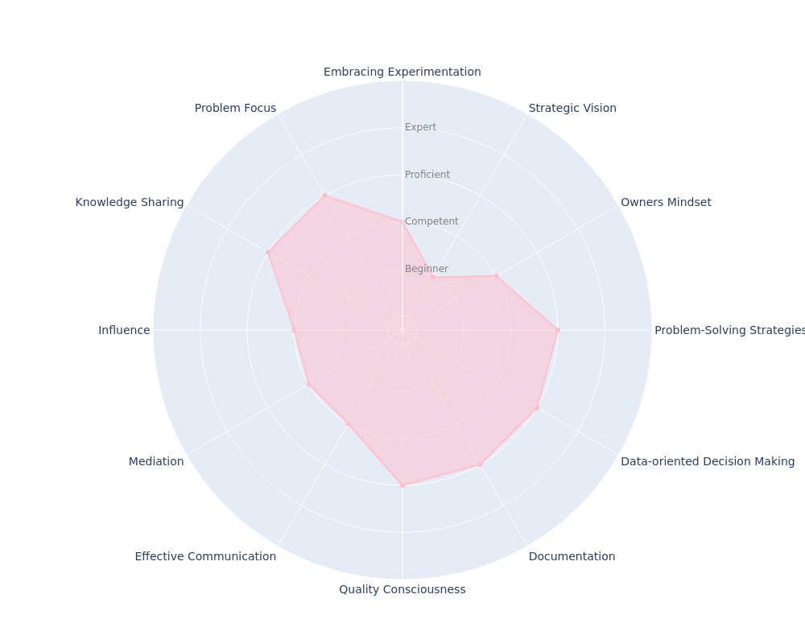

---
hide:
- toc
---
# Senior Engineer (L3)

## Key Takeaways

* Transitions to a more problem-solver role while maintaining implementation abilities
* Embraces ambiguity and take responsibility for identifying and designing solutions
* Recognizes the boundaries of their skills and explore new areas
* Collaborates regularly with other engineers, contributes to others' development, using techniques such as mentoring and delegation
* Participates in hiring processes and may positively influence changes to it
* Is a model of VTEX culture to people from their team
* May consider the option of transitioning to an Engineering Manager role

## Common Pitfalls

* Struggles to balance technical knowledge with understanding business goals
* Is hesitant to delegate tasks and give junior team members more responsibility
* Has challenges in effectively communicating with other teams
* Does not prioritize the development of their soft-skills

## Discussion

As you progress to this level, you will consolidate a transition and act more as a problem-solver while still maintaining your abilities as an implementer. Starting a new stage is like wrapping the last one; new tasks will show up, and the most significant change is the amount of time dedicated to each type of task.

As you take on more diverse tasks, your workdays may feel less routine and more fluid, giving the impression that time is passing more quickly or that your productivity has decreased. It can be beneficial to seek advice from individuals who have gone through or are currently experiencing this phase, as they may offer valuable insights and guidance.

At this stage, you will encounter more ambiguous situations as you comprehensively understand the product and be responsible for identifying and designing solutions. You'll also see opportunities for improving internal design, integrations, development, deployment, and on-call processes. Being active on pull requests is an excellent way to share your knowledge with others.

In addition to your responsibilities in delivering and improving the product, it's important to contribute to other people's development and actively participate in hiring processes.

Collaborating with other engineers, on your team or outside, will be crucial to successfully complete larger projects. It's essential to learn how to delegate tasks effectively. Keep in mind that delegating a task to someone expecting they will complete it in the exact same way as you do would only lead to frustration. It's crucial to recognize and respect the individuality of each person.

In addition to collaborating with other engineers, you should also start relying on EMs (Engineering Managers) and PMs (Product Managers). Building a solid support network will be tremendously helpful as you face new challenges at this career stage.

It's essential to develop the skill of prioritizing problems that require your attention and recognizing the ones that more junior engineers can solve. Attempting to solve every problem that comes up can be draining and may not lead to long-term solutions. Instead, focus on the most critical issues that will have the most significant impact and mentor more junior engineers in solving the appropriate problems.

You have reached a level of expertise where your implementation skills are well-established. Others will likely view you as a leader or an example for specific topics; this is an excellent opportunity for you to become a mentor to others! By helping others grow, you can also enhance your own skills. It's a win-win situation that you won't want to miss out on!

Although you may have a strong foundation for completing daily tasks, it is vital to recognize the boundaries of your skills and not be afraid to explore new areas where you may not be as proficient. These new areas may look so far away but take your time and don't rush through them.

You may face an important decision at this point of your career: whether to continue developing as an engineer or explore a lateral move to an Engineering Manager (EM) position. Take your time and consider your options, as this decision can be made at any point during this stage.

This stage is one of growth and change, so it's crucial to understand that learning from your journey is necessary to continue growing. The following quote reflects this idea:

???+ quote
    _"The real voyage of discovery consists not in seeking new lands but in seeing with new eyes.”_
    -- __Marcel Proust__ (In Search of Lost Time, Vol. 5)

By the end of this level, you will be able to confidently design and implement solutions that may have some level of uncertainty. You should help to provide a collaborative environment among other engineers. The proposed solutions need to be robust while striking a balance between short-term and long-term perspectives.
